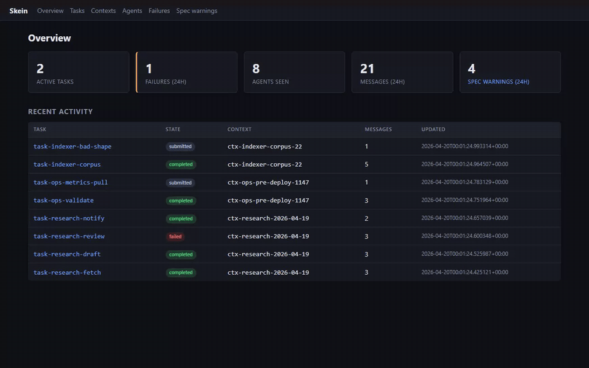
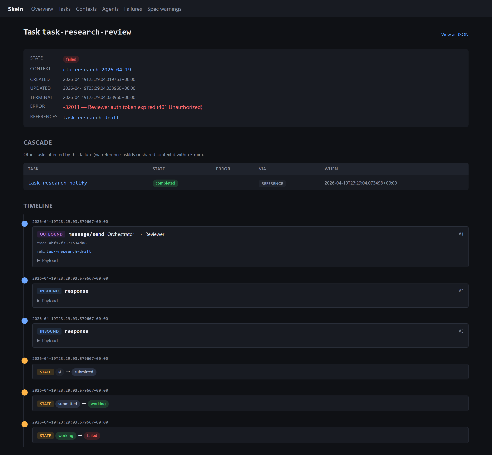
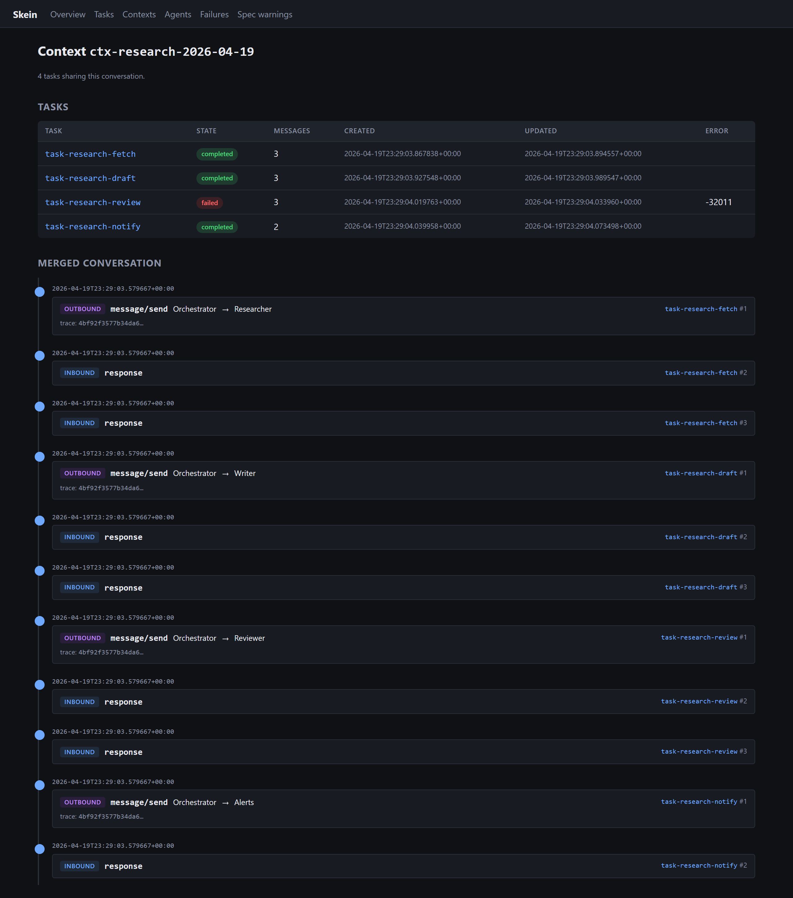
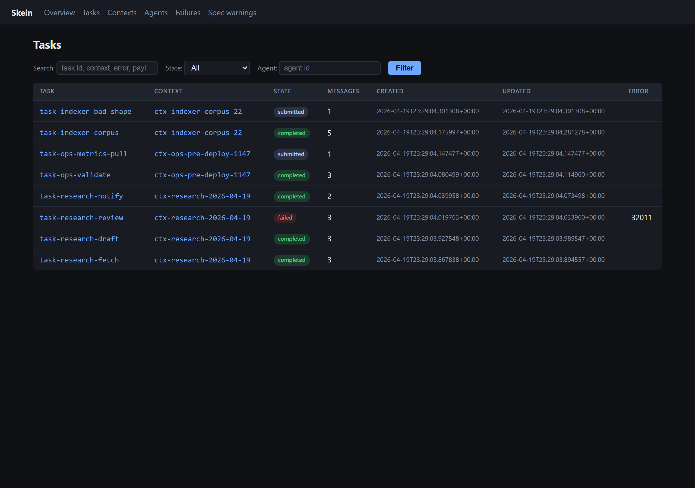
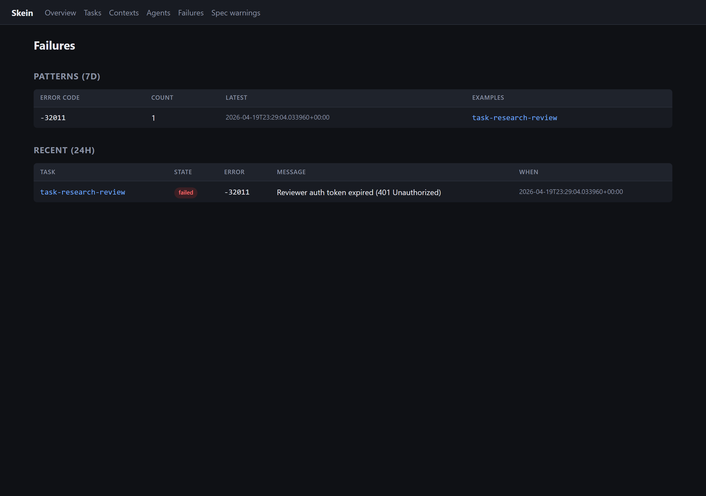
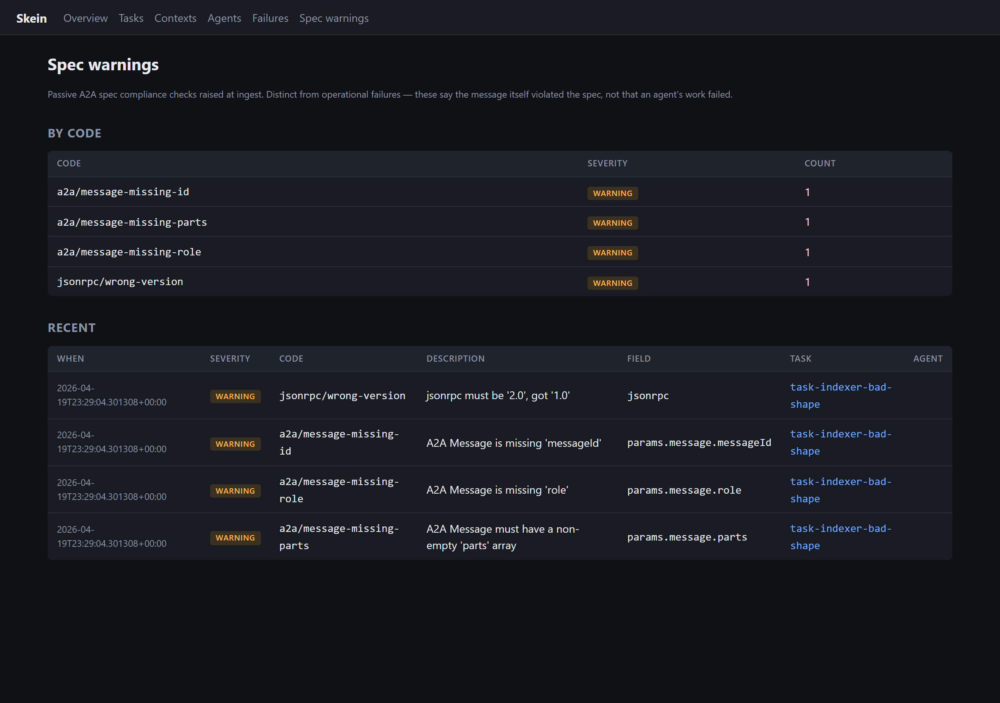

# Skein

[](https://github.com/jarmstrong158/skein/actions/workflows/ci.yml)
[](LICENSE)
[](https://www.python.org/downloads/)
[](https://github.com/astral-sh/ruff)
[](https://mypy-lang.org/)

**When your local multi-agent A2A system breaks, Skein tells you what happened in plain English.** Drop a webhook URL into your agents, run your workflow, and ask Claude what failed. No cloud, no accounts, no setup beyond `pip install`.



## What Skein is

A local-first, zero-config debugger for multi-agent [A2A](https://github.com/a2aproject/A2A) systems with conversational Claude integration. Built for the developer who wants to `pip install` something and immediately see what their agents are saying to each other.

- **Local-first.** SQLite, runs on `localhost`, no auth, no telemetry.
- **Zero-config ingestion.** One webhook endpoint. Point your agents at it, you're done.
- **Conversational debugging.** MCP server lets Claude Desktop or Claude Code answer "what failed in the last hour" against your captured traces.
- **Spec-aware.** Honors A2A `contextId`, `referenceTaskIds`, and W3C `traceparent`. Cascade detection pairs a deterministic `referenceTaskIds` signal with a heuristic same-context time window, and labels every result with which one fired — see [Cascade detection](#cascade-detection).
- **Windows-packaged.** Single-file installer ships Python and Skein together; no toolchain required for end users.

## What Skein is *not*

Skein deliberately does **not** compete with these — use them for what they're good at:

| Tool | Better choice when... |
|---|---|
| [A2A Inspector](https://github.com/a2aproject/a2a-inspector) | You're developing a single A2A agent and want spec-compliance checks + a live chat debug console. |
| [AOP](https://github.com/aop-protocol/aop) | You want decorator-based instrumentation across MCP, LangChain, CrewAI, A2A, AP2 in one SDK. |
| [Agent Gateway](https://agentgateway.dev) | You're running A2A in production and need a routing/security proxy. |
| OpenTelemetry + Datadog/Jaeger/Honeycomb | You're operating at scale and want enterprise observability with retention and alerting. |
| OWASP AOS | You're building a guardian-agent observability layer at the protocol level. |

Skein is smaller, more opinionated, and more narrowly useful than any of these. That's the feature.

---

## See it

### One task, full timeline — messages, state transitions, artifacts, cascade

A failed task with the explicit error, an OTLP trace ID per message, and the cascade table showing which other tasks were affected.



### Whole conversation, merged across tasks

A2A's `contextId` groups multiple tasks into one logical conversation. Skein assembles them into a single chronological view.



### Tasks page — filter by state, agent, or free-text search

Auto-refreshes via HTMX. Search hits task IDs, context IDs, error fields, and raw payload bodies.



### Failures grouped by error code

`skein/timeout` is the synthetic code raised by the stale-task sweeper.



### Spec compliance warnings — separate from operational failures

A spec warning says "this message was malformed"; an operational failure says "this agent's work failed". Different lists, different mental models.



### Conversational debugging via Claude (MCP)

Claude Desktop / Claude Code with the Skein MCP server connected:

> **You:** what failed in the last hour?
>
> **Claude:** *(calls `get_recent_failures`)* One failure: `task-research-review` failed at 19:29 UTC with error `-32011` — "Reviewer auth token expired (401 Unauthorized)". It was in context `ctx-research-2026-04-19`. Want me to pull the full timeline?
>
> **You:** yes
>
> **Claude:** *(calls `get_task_timeline`)* The orchestrator sent the review request to the reviewer agent at 19:29:03 referencing `task-research-draft`. The reviewer transitioned `submitted → working → failed` over 30 seconds before the 401. The failure cascaded to `task-research-notify` which alerted #oncall-research successfully. The auth token issue is the root cause — the reviewer's never recovered.

---

## Install

```bash
git clone https://github.com/jarmstrong158/skein
cd skein
python -m venv .venv
.venv\Scripts\activate          # Windows  (use 'source .venv/bin/activate' on Linux/macOS)
pip install -e ".[dev,mcp]"
cp config.example.json config.json
```

A pre-built `Skein-X.Y.Z-Setup.exe` is published with each GitHub release for users who don't want a Python toolchain. See [packaging/windows/README.md](packaging/windows/README.md) for build details.

## Quickstart

```bash
# Run the dashboard + ingest server (with stale-task sweeper running every 60s)
skein serve
# -> http://127.0.0.1:5050

# In another terminal, send a synthetic 8-task / 3-context A2A workflow
skein demo

# Open the dashboard at http://127.0.0.1:5050
```

To capture from your own A2A agents, have each agent POST every JSON-RPC payload it sends or receives to `http://127.0.0.1:5050/trace/ingest`:

```jsonc
// POST /trace/ingest
{
  "payload": { /* the A2A JSON-RPC envelope, verbatim */ },
  "direction": "outbound",                     // or "inbound", relative to the capturing agent
  "captured_at": "2026-04-19T10:00:00Z",       // optional; server stamps if absent
  "protocol_version": "0.3.1",                 // optional; tagged on the message
  "traceparent": "00-...-...-01"               // optional; W3C trace context
}
```

Skein auto-extracts trace IDs from `Message.metadata` / `Task.metadata` (the A2A extension pattern), so for many setups you don't need to forward `traceparent` separately. If your A2A library captures the W3C HTTP header before reconstructing the JSON-RPC body (a common pattern — see [kagent#1295](https://github.com/kagent-dev/kagent/issues/1295)), pass it as the optional top-level field above.

A typical integration is a one-line wrapper around your existing HTTP transport that does the POST. If you'd rather use a library that decorates your agent code, **use [AOP](https://github.com/aop-protocol/aop)** — it spans more protocols and has a richer SDK than anything Skein will ship.

## Ask Claude about your traces (MCP)

Add to your Claude Desktop or Claude Code MCP config:

```json
{
  "mcpServers": {
    "skein": {
      "command": "skein-mcp",
      "env": {
        "SKEIN_DB_PATH": "C:\\path\\to\\your\\skein\\data\\skein.db"
      }
    }
  }
}
```

Six tools: `get_recent_failures`, `get_task_timeline`, `list_active_agents`, `get_agent_activity`, `query_failure_patterns`, `export_trace`.

## CLI

| Command | Purpose |
|---|---|
| `skein serve` | Run the dashboard + ingest server + background scheduler. |
| `skein demo` | Send a synthetic 8-task / 3-context A2A workflow to a running Skein. Idempotent. |
| `skein clean --older-than 7d` | Delete terminal tasks (and their messages, transitions, artifacts, warnings) older than the cutoff. Supports `--dry-run`. |

## HTTP API

| Method | Path | Purpose |
|---|---|---|
| `POST` | `/trace/ingest` | Ingest one A2A JSON-RPC payload (see body shape above) |
| `POST` | `/trace/agent_card` | Upsert an agent card (identity + skills) |
| `GET`  | `/trace/health` | `{status, db_size_mb, message_count_24h}` |
| `GET`  | `/` | Dashboard overview |
| `GET`  | `/tasks` | Filterable, searchable, auto-refreshing task list |
| `GET`  | `/tasks/<id>` | Task timeline (HTML; add `?format=json` for JSON) |
| `GET`  | `/contexts` | A2A `contextId` groups |
| `GET`  | `/contexts/<id>` | Merged conversation across tasks in a context |
| `GET`  | `/agents` | Agent list |
| `GET`  | `/failures` | Failures grouped by error code |
| `GET`  | `/spec-warnings` | Passive A2A spec compliance warnings |

## Spec compliance

Skein passively validates every ingested payload against the A2A spec and records any violations as **spec warnings** — distinct from operational failures. A spec warning says "this message was malformed"; an operational failure says "this agent's work failed". They're surfaced in their own dashboard page and badged on individual task detail pages.

## Cascade detection

When a task fails, Skein looks for other tasks that failure plausibly took down. It uses two signals, and they are **not** equally strong. Every cascade row carries a `via` label saying which one fired, so you can weigh the evidence yourself rather than taking Skein's word for it.

| `via` | Signal | Strength |
|---|---|---|
| `reference` | Another task's message named the failed task in A2A `referenceTaskIds`. | **Deterministic** — the lineage edge is asserted by the protocol, not inferred. |
| `context` | Another task shares the failed task's `contextId` and reached a failure state within 300 seconds after it. | **Heuristic** — the shared `contextId` is spec-derived, but the time window is a correlation guess. |
| `reference+context` | Both signals fired for the same task. | Strongest available. |

The reference signal is additionally constrained by ordering: a task that had already reached a terminal state *before* the failure cannot have been affected by it, so it is excluded. Tasks still running at that moment are kept regardless of how they end — a task that referenced the failure and still completed is part of the lineage story.

The context signal is a **lead, not a verdict**. Two tasks in one conversation failing within five minutes is often one root cause and sometimes a coincidence; Skein surfaces the correlation and lets you judge. If you only want protocol-asserted edges, read the rows where `via` is `reference` or `reference+context` and ignore the rest. The window is the `window_seconds` argument to `cascade_for()`.

## Architecture intent

Skein's ingestion layer is architecturally pluggable. v1 ships a single source — the A2A webhook endpoint — but the parser/normalizer split was designed so additional sources (AOP, OWASP AOS, an OTLP receiver) can be added without touching the storage or dashboard. See [docs/ARCHITECTURE.md](docs/ARCHITECTURE.md).

## Tests

```bash
pytest -q       # 130 tests
ruff check .    # lint
mypy skein skein_mcp   # type-check
```

CI runs all three across Python 3.10/3.11/3.12 on Ubuntu and Windows.

## Roadmap

- **Phase 1 — Capture spine** ✅ ingest webhook, SQLite schema, parser/normalizer
- **Phase 2 — Timeline + dashboard** ✅ Flask + HTMX dashboard, dark-themed timeline view
- **Phase 3 — Failure detection** ✅ stale-task sweep, cascade detection, `/failures`, `skein demo`/`serve` CLI
- **Phase 4 — MCP server** ✅ 6 tools for Claude Desktop / Claude Code
- **Phase 5 — Packaging + release** ✅ PyInstaller spec, NSIS installer, GitHub Actions CI
- **Phase 6 — OTLP-aware ingestion + spec checks** ✅ W3C trace context capture, passive `/spec-warnings`
- **Phase 7 — UX polish** ✅ `/contexts` view, task search, HTMX auto-refresh, `skein clean`, screenshots, `ruff`+`mypy` in CI
- **v1.1 — OTLP export.** Forward captured traces as OTLP to Datadog / Jaeger / Honeycomb. Skein stays a local capture layer that can feed enterprise tooling when users scale up.
- **v1.2+** Optional Python SDK for decorator-based capture (only if users specifically request it; the recommended path remains the webhook).
- **Later, demand-driven.** Additional ingestion sources (AOP, OWASP AOS) plugged into the existing parser/normalizer split.

See [CHANGELOG.md](CHANGELOG.md) for the per-release detail.

## Contributing

Early-stage portfolio project. PRs welcome — particularly for additional A2A payload shapes, OTLP export, and the v1.1 forwarder.

## License

MIT — see [LICENSE](LICENSE).
